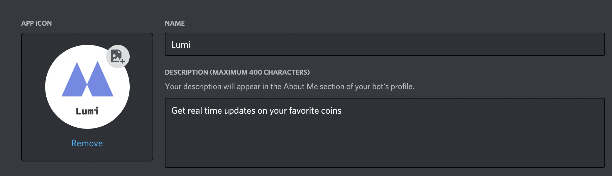
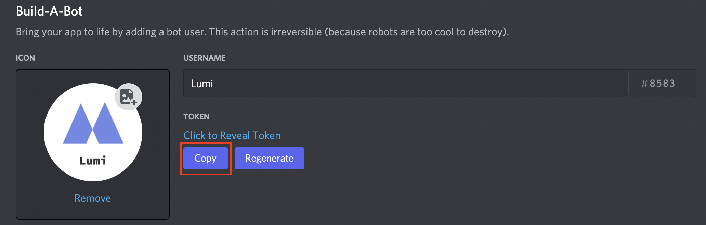
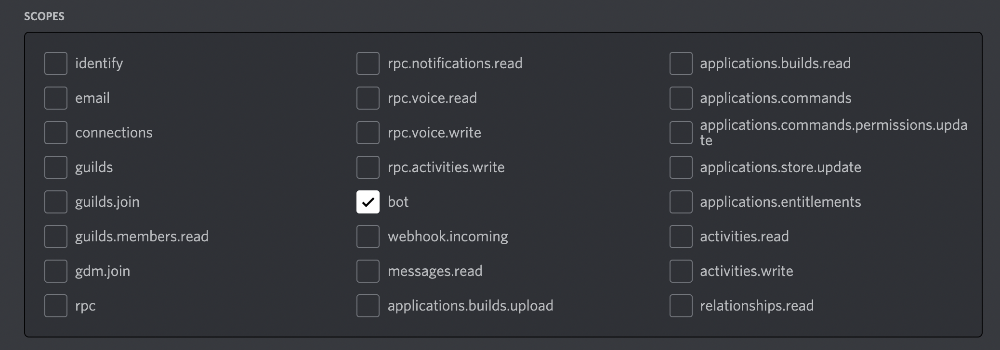
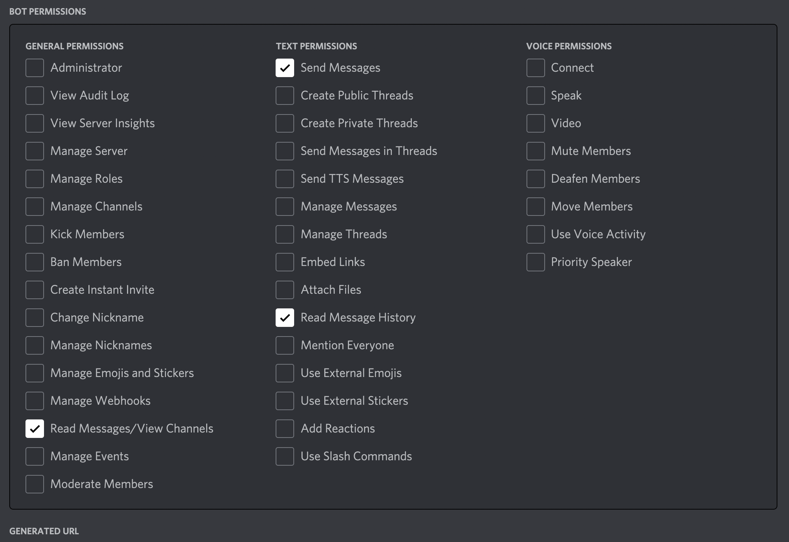
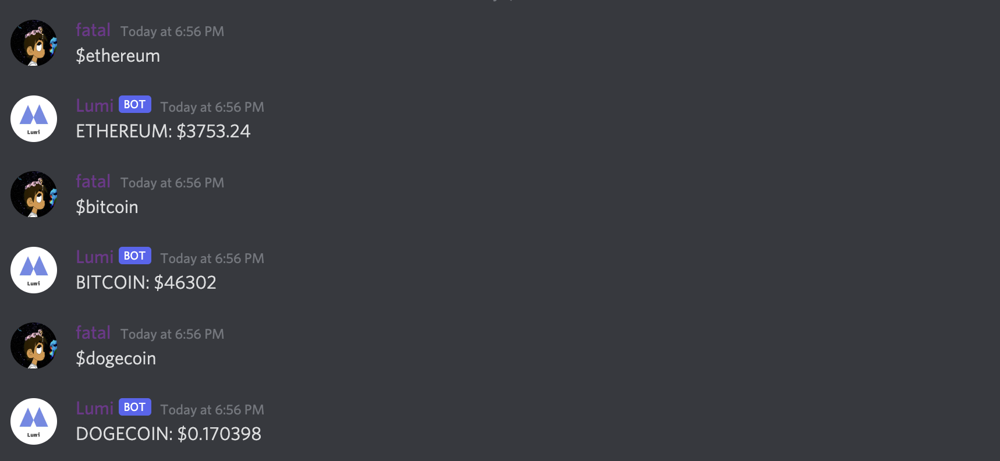
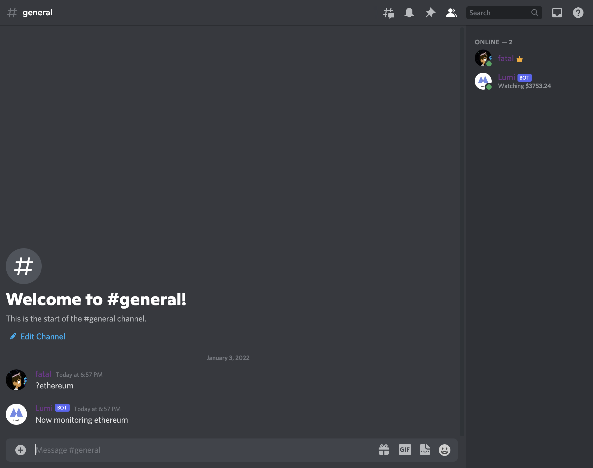
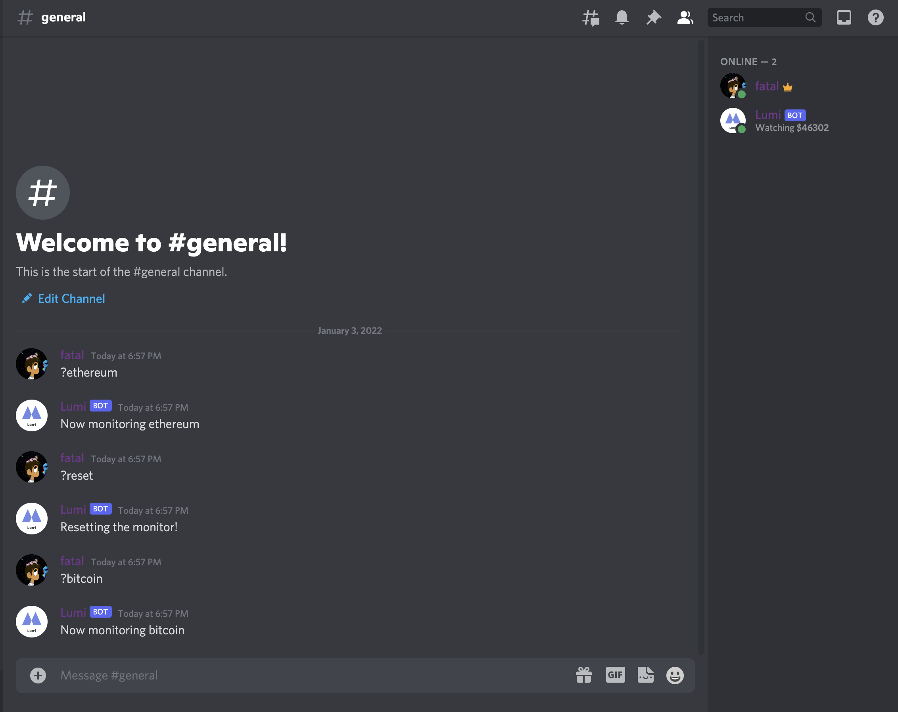

# Lumi-Bot
Discord bot that fetches and monitors cryptocurrency prices utilizing CoinGeko API.

## Requirements

Python modules needed: discord, asyncio, time, os, pycoingecko, dotenv

```bash
pip install discord asyncio time os pycoingecko dotenv
```

First you will need to create a free [Discord](https://discord.com/) server. 

Next, create a new application on the Discord developer portal by clicking the button in the top right corner at https://discord.com/developers/applications.



Click into the Bot menu item. You can name your bot and give it an avatar, but the only requirement is that you copy the Bot token:



You will need to change the `.env` file to your **own** bot token you copied, for example: 

```
DISCORD_BOT_TOKEN=OTI2OTAxNTkzMzQzOTE4MTEw.YdCaYA.71_r6VHSIFVvWyXDVB7YtYbv4hQ
```

Click into the OAuth2 menu item. Give your application the bot scope:



Then, scroll down to the next section and give your bot the following permissions under Bot Permissions:



Copy and paste the generated OAuth URL below into your browser to add the newly created bot to your server. In order for the script to run remember to edit the `.env` file to your own bot token! 

## Run Locally
```bash
python lumi.py
```

## Heroku

This app can be easily deployed to Heroku for free to run the bot 24/7. Here is an in depth YouTube video on doing so:
https://www.youtube.com/watch?v=BPvg9bndP1U

## Usage
Your discord server should look like this once its up and running:


This bot utilizes the full name of the token listed on [CoinGecko](https://www.coingecko.com/). Use `ethereum` instead of `eth`.

To check the price of a token in any text channel visible to LumiBot, use the `$` prefix: 
```
$ethereum
```


To monitor the price of the token and have the bot status update every 10 seconds with a new price, use the `?` prefix as follows:
```
?ethereum
```


To monitor another token, you must first use the `?reset` command:



